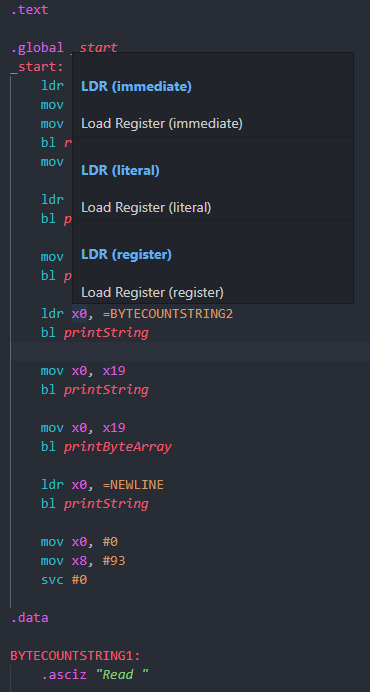

# VSCODE ARM64 Assembly

## Features

Adds some ARM64 assembly to vscode. 
Features: 
+ File icon
+ Syntax highlighting
+ Hover for link to documentation (https://developer.arm.com/documentation/ddi0602/2022-03?lang=en)

## Known Issues

The syntax highlighting is very basic regex, will probably miss some things.

## Release Notes

Version 1! Very basic implementation of syntax and hover provider. 
Might add some sort of completion. 

### 1.0.0

Initial release of ARM64.

### 1.1.0

Restructure src and fixed a few regex issues.
